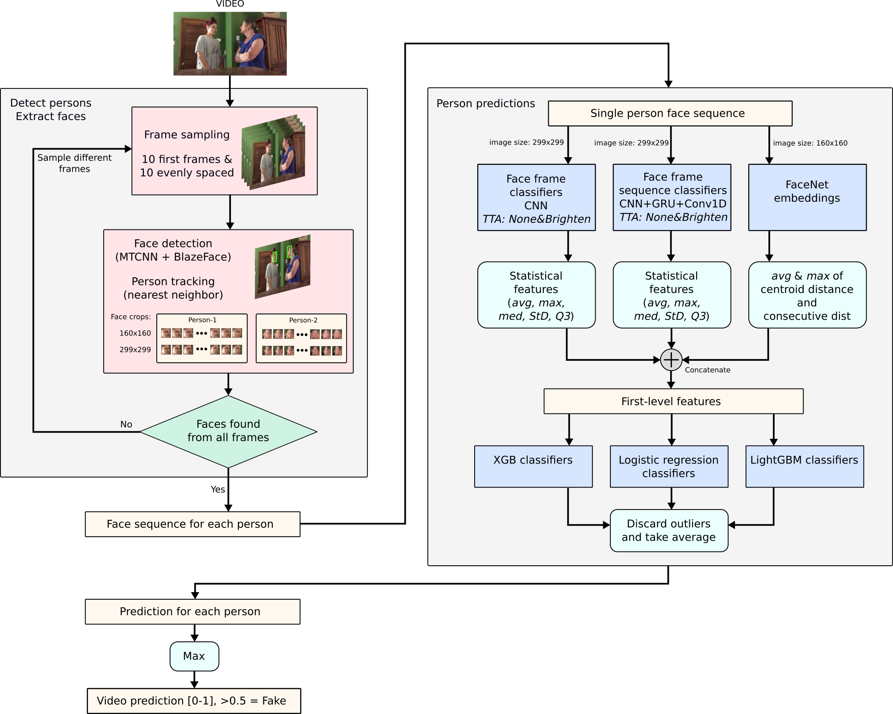

# Deepfake Detection Challenge

**Team rähmä.ai solution to [Deepfake detection challenge](https://www.kaggle.com/c/deepfake-detection-challenge)**

[Kaggle's dataset](https://www.kaggle.com/c/deepfake-detection-challenge/data)

## Overview

Our method samples frames from a given video and extracts faces of each person. First-level models predict fakeness of the extracted faces and the statistical features of all predictions are fed to second-level classifiers. Each person is given a fake probability and the deepfake classification is the maximum of all person predictions.



## Installation

It is highly recommended to run this in a python virtual environment.

```bash
python3 -m venv torch_env
source torch_env/bin/activate
pip3 install -r requirements.txt
```

## Inference

Before using the detector, download and extract [deepfake_2020_03_09.zip](https://drive.google.com/file/d/1w9bzrhknycVBxz_3A5d1tDLkoJuUGZtk/view?usp=sharing) trained models into `model_packages` folder. The folder structure should look like this.

```
root
  |-data
  |-data_generation
  |-detector
  |-model_packages
  | |-deepfake_2020_03_09
  |   |-large_face_classifier
  |   |-recurrent_cnn_models
  |   |...
  |
  |-pretrained_models
  | |-blazeface
  |
  |-testing
  |-training
  |-util
  |-validation
```

### Script usage

`predict.py` script returns a fake probability [`0-1`] for a video file, where `1` is fake and `0` is real. On error cases such as file not found, the script returns `-1`

```bash
python predict.py video_file_path
```

### Module usage

`detector` includes everything that is needed for running inference.

**1. Import DeepFakeDetector class**

```python
import sys
# append detector path to sys path
sys.path.append(detector_dir)
from DeepFakeDetector import DeepFakeDetector
```

**2. Initialize DeepFakeDetector class**

The main arguments (see DeepFakeDetector.py for all arguments):
- `deepfake_models_directory` (str): model folder of trained classifiers
- `third_party_models_directory` (str): model folder of third party files such as blazeface weights
- `predict_on_error` (float): This value gets predicted on Predict method's error. default=0.5.
- `verbose` (int): 0 = silent, 1 = print errors and warnings, 2 = print processing times of components and all errors and warnings. default=0. 

```python
deepFakeDetector = DeepFakeDetector(deepfake_models_directory="./kaggle_datasets/deepfake_2020_03_30/",
                                    third_party_models_directory="./pretrained_models/")
```

**3. Predict**

Prediction for any fake persons in the video. Returns confidence for a fake [0-1].

Arguments:
- `videoPath` (str): Videofile path
- `frame_offset` (int): start processing video from this frame, default=0
- `handleErrors` (bool): If True (default), the method handles exceptions and outputs predict_on_error. If False, the exception is passed to caller.
- `featureClassifiers` (listo of str): Listo of what feature classifiers to combine. Available options are: xgb, logreg and lightgbm. All are included by default.
- `multiPersonMode` (str): How to combine predictions of multiple persons. One of max, avg, weighted-avg. In weighted avg, weights are 1 and 2 for <0.5 and >=0.5 predictions. Default=max

```
deepFakeDetector.Predict(video_path)
```

## Training

The training process described in detail (notebooks and scripts included). You can follow these steps for training new models.

### [1. Data preparation](data_generation)

- Data sampling
- Actor clustering
- Level of alteration grouping
- Data splitting

### [2. Training classifiers](training)

- Training face frame classifiers
- Training face frame sequence classifiers (RCNN)

### [3. Training second-level classifiers](validation)

- Training second level feature classifiers (XGB, Logistic regression, LightGBM)

### [4. Testing](testing)

- Testing with two-person videos

----------------------------------

## Authors

**Team rähmä.ai**

[Joni Juvonen](https://github.com/jpjuvo)

[Mikko Tukiainen](https://github.com/mjkvaak)
