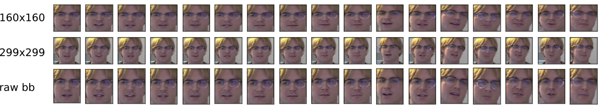
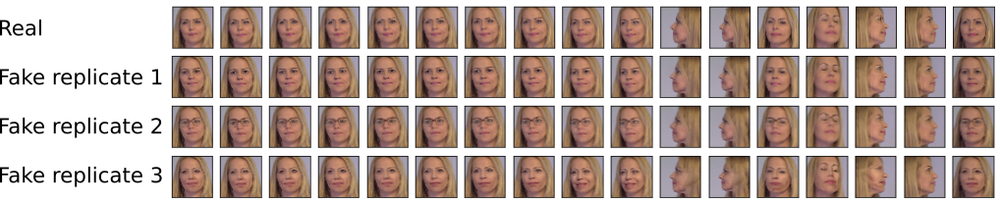
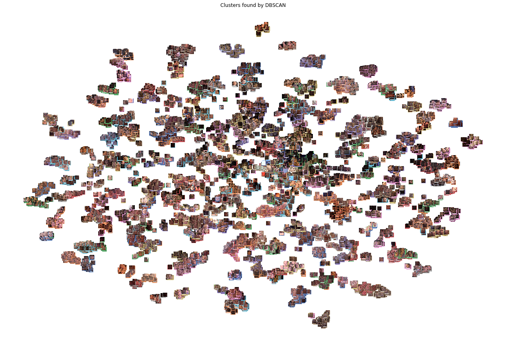
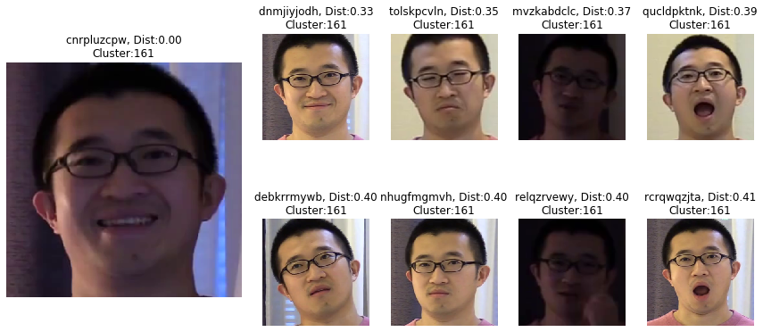
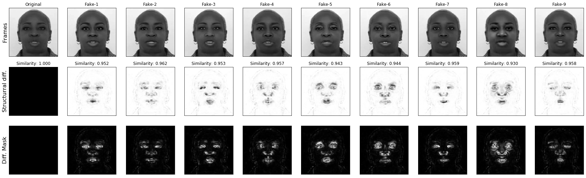
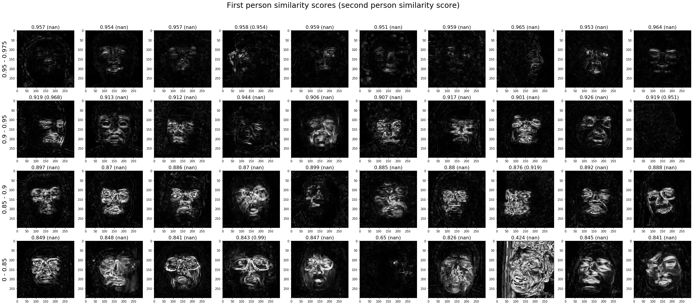
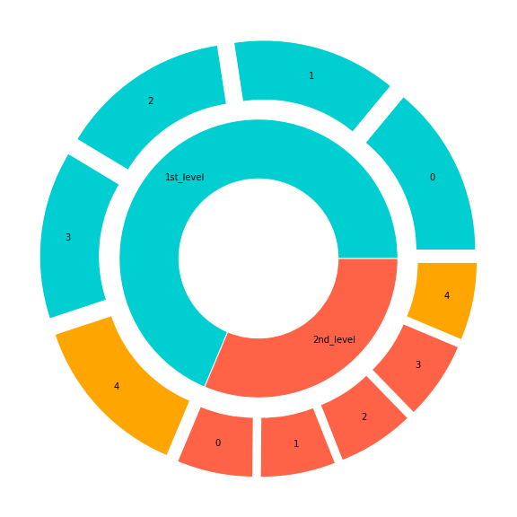

# Data preparation

## 1. Data collection

Each "real" labeled video had one or more altered "fake" videos. Fake videos had visual differences mainly in face regions and a small part of the fakes were also audio manipulated.

- Ten first, and after that, seven evenly spaced frames were collected from each "real" labeled video.
- Faces were exctracted from each frame using combined and thresholded detections from MTCNN and Blazeface.
- Face detection bounding boxes were parsed into frame sequence using nearest neighbor tracking and missing detections were interpolated. 
- If a second face was found in less than half of the frames, only one face sequence was kept.
- If faces were not found from all frames after interpolation (filled gaps of one), video frames were sampled again with an offset of additional 20 frames and this was repeated five times at maximum until a video was discarded.
- The same face bounding box coordinates and video frames were sampled from the "fake" replicates.
- Face bounding boxes were cropped and saved in stretch resized 160x160, aspect resized with extended 15 % margin 299x299, and raw unresized png images.
- [Facenet](https://github.com/timesler/facenet-pytorch) embeddings were collected from the 160x160 faces using the pretrained InceptionResnet model (MIT license).

Sample of collected faces from one video. Top row = small faces (160x160), middle row = large faces (299x299), and bottom row = raw faces (face bounding box size). Total of 17 frames were the first ten are from the start of the video and the following seven are sampled evenly from the rest of the video.

Samples from real video (top row) and the corresponding samples from altered fake videos (rows 2,3 and 4).

[Data generation notebook](2020-02-08_data_generation.ipynb)

## 2. Actor clustering

[Facenet](https://github.com/timesler/facenet-pytorch) embeddings of all the persons from "real" videos were clustered using t-SNE and clustered into individual actors using DBSCAN.

The same actor in multiple videos.

[clustering notebook](20200213-Face_clusters.ipynb)

## 3. Level of alteration grouping (fake classes)

The level of fake alteration was determined for each face frame by comparin g the structural difference between "fake" and corresponding "real" frames.

Frame-level differences were calculated in [Pixel difference notebook](2020-02-09_pixel_difference_masks.ipynb).

Fakes were grouped into four types based on strutural similarity (rows are groups 0-4 from top to bottom, where 0 = similar and 4 has the largest difference). The groupings were made in [this notebook](20200214-DeepFake-type-clustering.ipynb) and further refined in [this notebook](20200322-Refine_fake_types.ipynb)

## 4. Data split

Change the data paths in `user_config.json` to correct paths. Embeddings, small and large faces are generated by the [data generation notebook](2020-02-08_data_generation.ipynb).

- `video_path`=[Kaggle Deepfake detection challenge videos](https://www.kaggle.com/c/deepfake-detection-challenge/data)
- `facenet_embeddings`= Face embeddings directory
- `small_faces`= 160x160 face crops
- `large_faces`= 299x299 face crops

> Tested on Ubuntu 18.04.3

### Folds explained

The data has been split into 1st and 2nd level with 85%-15% categories ratio. The two categories have further been evenly split into 5 folds. In both of the splits, all FAKE videos labelled coming from same actor are included in only one of the splits to avoid actor leakage.

1st level split is used for training the 1st level feature extraction models in 5-fold CV manner. The 2nd level split is reserved for training and validating the 2nd level model in a similar way.

